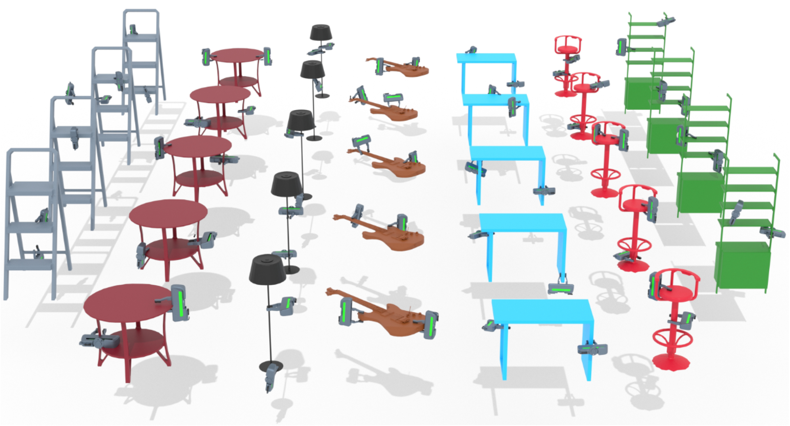

# DG16M: A Large-Scale Dataset for Dual-Arm Grasping with Force-Optimized Grasps

<a href="">Md Faizal Karim</a><sup>1</sup>, <a href="">Mohammed Saad Hashmi</a><sup>1</sup>, <a href="">Shreya Bollimuntha</a><sup>1</sup>, 
<a href="">Mahesh Reddy Tapeti</a><sup>1</sup>, <a href="">Gaurav Singh</a><sup>1</sup>, <a href="">Nagamanikandan Govindan</a><sup>2</sup>, 
<a href="">K Madhava Krishna</a><sup>1</sup>

<sup>1</sup> Robotics Research Center, IIIT Hyderabad \
<sup>2</sup> IIITDM Kancheepuram

### <a href="https://dg16m.github.io/DG-16M/" target="_blank">[Project Website]</a> <a href="https://arxiv.org/abs/2503.08358" target="_blank">[Arxiv]</a>



## Download the Dataset
Download the dataset from <a href="https://iiithydresearch-my.sharepoint.com/personal/md_faizal_research_iiit_ac_in/_layouts/15/onedrive.aspx?id=%2Fpersonal%2Fmd%5Ffaizal%5Fresearch%5Fiiit%5Fac%5Fin%2FDocuments%2FDG16M&ga=1">[Link]</a>.

```
>> unzip -l dg16m.zip

├── dg16m/
│   ├── dg16m/grasps 
│       │── dg16m/grasps/554fa306799d623af7248d9dbed7a7b8.h5
│       │── dg16m/grasps/c2ad96f56ec726d270a43c2d978e502e.h5
│       │── .....
│       │── dg16m/grasps/c8440e1075b1b44522de187cba227ff8.h5
└── ├── dg16m/meshes
        │── dg16m/meshes/554fa306799d623af7248d9dbed7a7b8.obj
        │── dg16m/meshes/c2ad96f56ec726d270a43c2d978e502e.obj
        │── .....
        │── dg16m/meshes/c8440e1075b1b44522de187cba227ff8.obj                  
```

## About the Dataset

```c
./de731d4ac7341e15c58e834f0b160845.h5
├── grasps
│   ├── contact_forces                  (4000, 4, 3)
│   ├── contact_points                  (4000, 4, 3)
│   ├── fc_passing_indices              (2000)
│   ├── fc_failed_indices               (2000)
│   ├── grasps                          (4000, 2, 4, 4)
│   └── loss_values                     (4000)
└── object/
    ├── file                            (str)
    └── scale                           (float)
```
Note: Some objects may have passing/failing grasps < 2000. Use the ```fc_passing_indices``` and ```fc_failed_indices``` to sort the grasps. 

## Installation 

```
pip install -r requirements.txt

cd grasp_generation/meshpy
pip install -e . 
```

## Dataset Generation
We first sample 500 single arm antipodal grasps and create all possible cominations to create dual-arm grasp candidates (along with distance pruning to remove extremely close pairs). They are then passed through the optimizer to find the force-closure valid dual-arm grasp pairs. Finally, we save 2000 valid and 2000 invalid grasp pairs in the dataset. These numbers can be changed in the code for further experimentation. 

```
cd grasp_generation/scripts

python3 generate_dg16m.py --meshes_path <PATH_TO_MESHES> --scaled_meshes <SAVE_PATH> --num_workers 16
``` 

Note: Change the number of CPU workers based on the system. The workers are used to parallelize the grasp generation and then run the CVXPY optimization in parallel using multiprocessing.  

## Visualize

Use <a href="./notebooks/viz_grasps.ipynb">viz_grasps.ipynb</a> to vizualize the grasps. 

## 👏 Acknowledgment

Our codebase in built upon the existing works of <a href="https://github.com/ymxlzgy/DA2">DA2 Dataset</a> and <a href="https://github.com/dkguo/PhyGrasp">PhyGrasp</a>. We thank the authors for releasing the code. 

## 📜 Cite 
```
@article{DG16M,
      title={DG16M: A Large-Scale Dataset for Dual-Arm Grasping with Force-Optimized Grasps}, 
      author={Md Faizal Karim and Mohammed Saad Hashmi and Shreya Bollimuntha and Mahesh Reddy Tapeti and Gaurav Singh and Nagamanikandan Govindan and K Madhava Krishna},
      year={2025},
      eprint={2503.08358},
      url={https://arxiv.org/abs/2503.08358}, 
}
```
